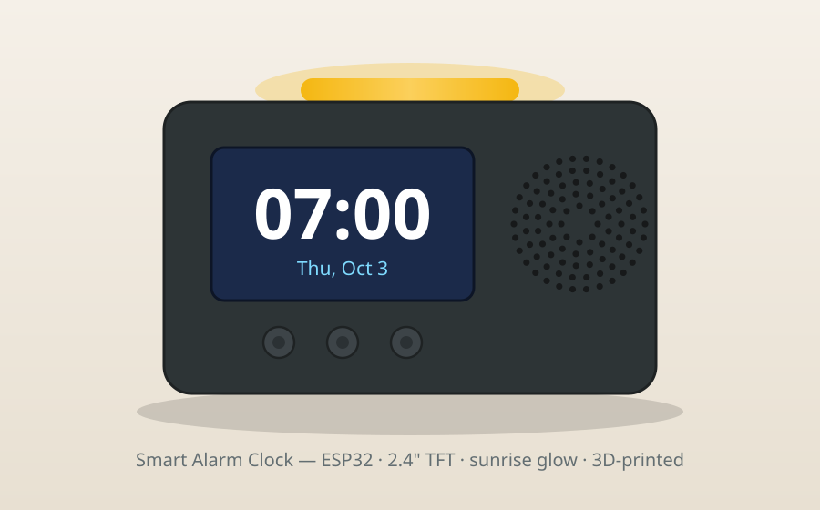
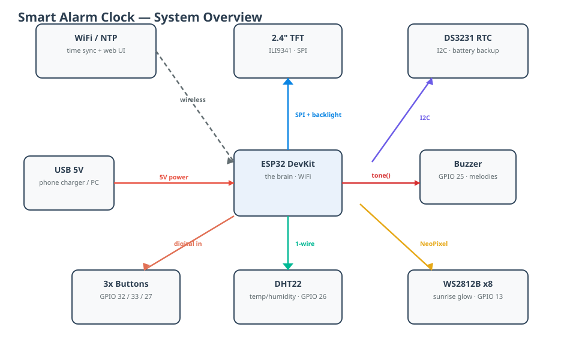
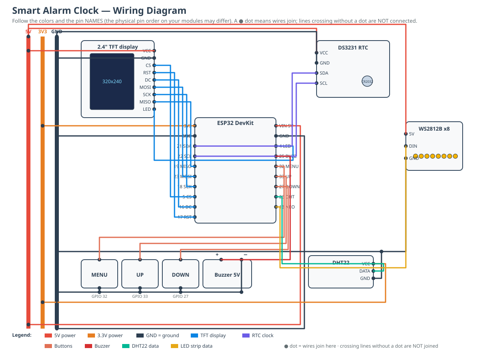

# Smart Alarm Clock

## Description

A WiFi-connected smart alarm clock you build yourself from off-the-shelf
parts for around $25–40. An ESP32 runs the show: it syncs time over WiFi
(NTP), falls back to a battery-backed real-time clock when offline, and
serves a tiny web page so you can set alarms from your phone.

**What it does:**
- Big 2.4" color display — time, date, room temperature & humidity, alarms
- 5 alarms, settable on-device (3-button menu) or from your phone's browser
- Sunrise simulation — an LED strip fades from deep orange to bright white
  in the 10 minutes before your alarm
- Buzzer melodies, 9-minute snooze (any button), dismiss (hold MENU 2 s)
- Screen brightness control; all settings survive reboots
- Custom 3D-printed enclosure with mounts for every component

**How it's wired** (see `circuit-schematic.svg` and `wiring-for-dummies.md`):

## What's in this folder

| File | What it is |
|------|------------|
| `smart_alarm_clock.ino` | Complete ESP32 firmware — upload with Arduino IDE |
| `enclosure.scad` | Parametric 3D model — open in OpenSCAD, export STLs, print |
| `circuit-schematic.svg` | Color-coded wiring diagram (opens in any browser) |
| `system-block-diagram.svg` | High-level architecture overview |
| `wiring-for-dummies.md` | Step-by-step wiring guide, assumes zero experience |
| `images/clock-illustration.svg` | Illustration of the finished clock |
| `BOM.md` | Full parts list with specs and quantities |
| `wiring.md` | Pin-by-pin wiring tables + block diagram |

## 1. Print the enclosure

1. Install [OpenSCAD](https://openscad.org/downloads.html) (free).
2. Open `enclosure.scad`. At the top, set `part = "layout"` and press **F5** —
   you'll see a transparent case with every component as a colored block.
   **Check the fit against your actual parts**, and tweak the dims at the top
   of the file if your TFT/ESP32 differ.
3. Set `part = "shell"`, press **F6** (render), **File → Export → STL**. Repeat
   with `part = "back"`.
4. Print both in PLA or PETG: 0.2 mm layers, 3 walls, 20% infill. No supports
   needed. Print the shell **front-face down** (display window on the bed) for
   the cleanest front finish.

## 2. Wire it up

Follow `wiring-for-dummies.md` (beginner-friendly, step-by-step) with
`circuit-schematic.svg` open beside it — or use the condensed pin tables in
`wiring.md` if you've done this before. Quick version: TFT on the SPI pins
(5/16/17/23/18/4), RTC on I²C (21/22), buzzer on 25, buttons on 32/33/27
(other leg to GND), DHT22 data on 26, LED strip data on 13. Everything runs
off USB 5 V.

## 3. Flash the firmware

1. Arduino IDE → install the **esp32** board package, select **ESP32 Dev Module**.
2. Library Manager → install: `WiFiManager` (tzapu), `RTClib`, `Adafruit GFX`,
   `Adafruit ILI9341`, `DHT sensor library`, `Adafruit NeoPixel`.
3. Open `smart_alarm_clock.ino`, set your timezone in `TZ_INFO` (examples in
   the comments), upload.

## 4. First boot

- The clock creates a WiFi network called **SmartClock-Setup**. Join it with
  your phone, pick your home WiFi — time syncs automatically via NTP.
- No WiFi? It falls back to the DS3231 — set the clock from the on-device menu.

## 5. Assemble

1. Press 4× M3 heat-set inserts into the back-cover bosses (or just use M3 nuts).
2. Screw the ESP32 to its 4 floor posts; plug in USB so the port lines up with
   the back-cover cutout.
3. Mount the TFT on its 4 standoffs behind the display window (M3×12
   standoffs + screws through the PCB holes).
4. Drop the speaker behind the grille, buzzer in its ring, RTC + DHT22 on foam
   tape, LED strip hot-glued inside under the top slot.
5. Stick the 3 buttons on a scrap of perfboard aligned with the front holes
   (or use panel-mount buttons), wire, close the back cover with 4× M3 screws.

## 6. Daily use

- **Set alarms**: on-device via MENU, or open the clock's IP in a browser
  (shown on the web page / serial monitor) — 5 alarms, all saved to flash.
- **Ringing**: any short button press = 9-minute snooze. **Hold MENU 2 s** = dismiss.
- **Sunrise**: 10 minutes before an alarm, the top LEDs fade from deep orange
  to bright white.
- **Brightness**: MENU → Brightness (also saved).

## Customizing

- Alarm melody: edit the `MELODY[]` note table (frequency Hz, duration ms).
- Snooze length / sunrise duration: `SNOOZE_MINUTES`, `SUNRISE_MINUTES`.
- Case size, window, hole positions: all parameters at the top of the `.scad`.
